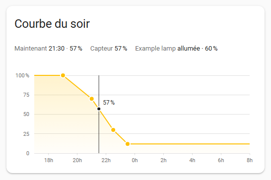
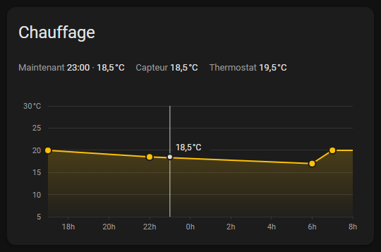

# Time Curve Card

A Home Assistant dashboard card to **draw a daily curve by dragging points**: time of day on the x
axis, a value on the y axis — a light's brightness, a thermostat setpoint, a colour temperature, or
any number you choose. The curve is stored as a short string in an `input_text` helper; a template
sensor in Home Assistant reads the same string, computes the value for the current time with
exactly the same rules as the card, and your automations send that value to a device. A curve is
easier to shape with a finger than with sliders for the start, the end, the levels and the shape of
a curve. The card's texts are in French.




## Features

- **Any daily value**: presets for brightness (%), temperature (°C) and colour temperature (K),
  or your own range, step, unit and label; values may have up to 2 decimals (`18.5`) and be
  negative.
- **Direct manipulation**: drag points (mouse, touch or pen), tap an empty spot to add one, select
  a point to type its time and value or delete it; keyboard support.
- **What you see is what the sensor does**: straight segments between points, flat before the
  first and after the last one, the same interpolation and rounding (exact integer arithmetic) in
  the card and in the Jinja sensor, both tested against one shared fixture.
- **Curves that cross midnight**: the curve day runs from 12:00 to 12:00 the next day, so
  `23:00@40;01:00@10` is one segment.
- **Live status**: the current time and the curve value at that time, the value of the target
  sensor and, when a rule of your own package overrides the curve, the reason it gives, and the
  state of the device the curve drives (a light, a thermostat, any entity).
- **A "now" marker** on the chart, also when the current time is outside the visible range.
- **Safe saving**: debounced writes, a saving / saved / error indicator, a revert to the stored
  curve on failure, and local edits that win over external updates until they are saved.
- **Touch first**: 44 px hit targets and no dashboard scrolling while you drag; designed for the
  Android companion app and tested with touch emulation on a phone-sized screen.
- **Theme aware**: only Home Assistant theme variables, so it works in light and dark themes; the
  curve colour can be overridden.
- **Visual editor** (a French form in the card editor), and a live preview in the **Add card**
  picker.

## How it works

```text
 dashboard card  --- input_text.set_value --->  input_text.brightness_curve
 (draws, edits)  <------- state --------------  "19:00@100;21:00@70;22:30@30;23:30@12"
                                                      |  read on every change,
                                                      v  and every minute (now())
 status row      <--- state, mode, reason ----  sensor.brightness_curve_target
                                                (Jinja interpolation, your override rules)
                                                      |
                                                      v
                                                automations -> light.turn_on,
                                                climate.set_temperature, ...
```

(The entity ids are those of the brightness example; the heating and colour temperature examples
use their own.)

- The **curve string** (format v2) is a list of `HH:MM@V` tokens joined by `;`, for example
  `19:00@100;21:00@70;22:30@30;23:30@12` or `17:00@20;22:00@18.5;06:00@17;07:00@20`: hour 0-23
  (one or two digits), two-digit minutes, and a value `V` of 1 to 4 digits with an optional `-`
  and an optional `.` followed by 1 or 2 decimals (`70`, `18.5`, `-2.05`; no `+`, no exponent, no
  comma). Each value is clamped to the card's `min` / `max`. The string must fit in an
  `input_text`, whose hard limit is 255 characters. The card writes a canonical string (sorted,
  no spaces, no trailing zeros: `18.50` becomes `18.5`) and reads leniently (spaces, duplicates
  and invalid tokens are tolerated); fewer than 2 valid points make the curve invalid. Strings of
  the first version (integer percentages) are valid v2 strings with the same meaning.
- The **curve day** runs from 12:00 to 12:00 the next day: a point at 11:00 comes _after_ a
  point at 23:00.
- **Evaluation** at a given time: before the first point, the first point's value; after the last
  point, the last point's value (at 3 a.m. a light stays at its night level); on a point, its value
  as stored; in between, linear interpolation rounded half up to a multiple of the `step`, then
  clamped to the range. Values are handled as whole numbers of hundredths on both sides, never as
  floating-point numbers, so the card and the sensor agree to the last digit. Seconds are ignored.
- The card and the sensor **must compute the same value** for the same string, range, step and
  time. The rules are specified in [docs/curve-spec.md](docs/curve-spec.md) and both
  implementations run the same cases from `test/fixtures/curve-cases.json` (Vitest for the card;
  for the sensors, pytest with a replica of Home Assistant's Jinja sandbox and filters, on the same
  `jinja2` version: not Home Assistant itself). The card draws straight segments only, because
  that is what the sensor computes.
- "Now" is computed in Home Assistant's time zone (not the phone's), like the sensor's `now()`.

## Installation

The card needs Home Assistant 2024.11 or later (`homeassistant` in `hacs.json`: the 12-column
sections grid used by the card's grid options). The example packages also use the automation
syntax of 2024.10.

### HACS (custom repository)

The repository needs at least one published, **non-pre-release** GitHub release carrying
`time-curve-card.js` (the Release workflow attaches it, see [Releasing](#releasing)). HACS ignores
pre-releases until "Show beta versions" is turned on for the repository, which is only possible
once the repository is added; with no stable release it falls back to the default branch, where
`dist/` is not committed, and refuses the custom repository ("Repository structure for
refs/heads/main is not compliant").

1. In Home Assistant, open **HACS**, then the **⋮** menu (top right) → **Custom repositories**.
2. Repository: `https://github.com/Pekno/hacs-time-curve-card`. Type: **Dashboard**. Select
   **Add**. To also get pre-releases later, open the card in HACS and turn on **Show beta
   versions**.
3. Open **Time Curve Card** in HACS and download it. HACS offers the latest releases (not the
   default branch, which holds no card file) and downloads `time-curve-card.js` from the release
   assets.
4. When your dashboard resources are managed from the UI (the default), HACS registers the
   resource itself (`/hacsfiles/time-curve-card/time-curve-card.js` for a repository named
   `time-curve-card`); if you manage resources in YAML, add that URL yourself with
   `type: module`.
5. Reload the dashboard (in the companion app: pull down to refresh).

### Manual

1. Get `time-curve-card.js`: from the assets of a GitHub release, or build it with
   `npm ci && npm run build` (the file is `dist/time-curve-card.js`).
2. Copy it to `/homeassistant/www/` (the `config/www` folder of the Samba share; create `www` if
   it does not exist: Home Assistant serves it as `/local/`, a restart is needed the first time
   the folder is created).
3. **Settings → Dashboards → ⋮ → Resources → Add resource**: URL
   `/local/time-curve-card.js?v=<version>` (the `version` of `package.json`), type
   **JavaScript module**. If the Resources entry is missing, turn on "Advanced mode" in your user
   profile.
4. After each update, copy the new file **and bump `?v=`** in the resource URL: Home Assistant
   and the companion app cache card files aggressively. The browser console shows a one-line
   banner `TIME-CURVE-CARD v<version>` when the card loads, so you can check which version is
   running.

## Home Assistant side

The card only needs the `input_text` helper. The template sensor is what turns the curve into a
value for your automations. Three complete, minimal packages are in [ha/](ha) (English comments
explain every block), each with a matching card configuration:

| Package                                                               | Card                                                                                | Curve                                            | Sensor                           | Drives                                         |
| --------------------------------------------------------------------- | ----------------------------------------------------------------------------------- | ------------------------------------------------ | -------------------------------- | ---------------------------------------------- |
| [example-package.yaml](ha/example-package.yaml)                       | [example-dashboard-card.yaml](ha/example-dashboard-card.yaml)                       | `input_text.brightness_curve`, 1-100 %           | `sensor.brightness_curve_target` | a light (`light.turn_on`, `brightness_pct`)    |
| [example-heating-package.yaml](ha/example-heating-package.yaml)       | [example-dashboard-heating-card.yaml](ha/example-dashboard-heating-card.yaml)       | `input_text.heating_curve`, 5-30 °C by 0.5       | `sensor.heating_curve_target`    | a thermostat (`climate.set_temperature`)       |
| [example-color-temp-package.yaml](ha/example-color-temp-package.yaml) | [example-dashboard-color-temp-card.yaml](ha/example-dashboard-color-temp-card.yaml) | `input_text.color_temp_curve`, 2000-6500 K by 50 | `sensor.color_temp_curve_target` | a light (`light.turn_on`, `color_temp_kelvin`) |

The brightness package, for example, contains:

- `input_text.brightness_curve`: the curve. `max: 255` is required (the default, 100 characters,
  is too short for a curve) and there is no `initial:`, so Home Assistant restores the drawn curve
  after a restart.
- `input_boolean.brightness_curve_enabled` ("Follow the curve"): when it is off, the sensor uses
  the curve's highest point instead. It is an example of an override rule; remove it if you do not
  need it. (The heating package has the same kind of rule, `input_boolean.heating_curve_enabled`,
  which gives a fixed comfort temperature of 20 °C; the colour temperature package has no override
  rule.)
- `sensor.brightness_curve_target`: the template sensor. Its value is the curve value now,
  computed with the same rules as the card; it is unavailable while the curve has fewer than 2
  valid points; its `mode` and `reason` attributes tell the card which rule applies (see
  [below](#the-sensors-mode-and-reason)).
- An optional automation, commented out, that makes a light follow the sensor while it is on.

To install one:

1. Packages must be enabled (`homeassistant: packages: !include_dir_named packages` in
   `configuration.yaml`). Copy the file to `/homeassistant/packages/` (e.g.
   `brightness_curve.yaml`), or paste its blocks into `configuration.yaml`. You may rename the
   entities: keep every reference in the file in sync.
2. Check the configuration (**Check configuration** in the **YAML** tab of the developer tools),
   then restart Home Assistant (new helpers need a restart).
3. Add the card: the matching card file lists its options with comments
   ([ha/example-dashboard-card.yaml](ha/example-dashboard-card.yaml) describes every option; paste
   it in **Edit dashboard → Add card → Manual**), or pick **Time Curve Card** in the card picker
   (see [Visual editor](#visual-editor)). Draw a curve, or tap "Réinitialiser la courbe" to write
   the default one.
4. To make a device follow the sensor, uncomment the automation at the end of the package and
   replace `light.your_light` (or `climate.your_thermostat`) with yours. It triggers on the
   sensor's state changes; the brightness one calls `light.turn_on` with
   `brightness_pct: "{{ trigger.to_state.state | int }}"` while the light is on.

Notes:

- The template uses `now()`, so Home Assistant renders it again at the start of every minute; the
  card's value can be ahead of the sensor's by up to a minute.
- The sensor's state is the value in the curve's own form (`18.5`, `70`, `2700`): a dot for the
  decimals, no trailing zero.
- The parse block follows the card's lenient rules exactly (keys in the 12:00 → 12:00 curve day,
  the last duplicate wins, values clamped to the range). It appears twice, in `availability` and
  in `state`, and must stay identical in both. Its first lines set the range and step in
  hundredths of a unit (`vmin`, `vmax`, `vstep`: `100`, `10000`, `100` for 1-100 % by 1): they
  **must match the card's `min`, `max` and `step`**, otherwise the card and the sensor compute
  different values. Add your own rules around it: do not change the parsing, the interpolation or
  the formatting, which the Jinja tests check against every case of the shared fixture.
- The heating sensor has no `device_class` on purpose: with `device_class: temperature`, Home
  Assistant would convert its state to the unit system of the installation.

### The sensor's mode and reason

The sensor can tell the card why its value differs from the curve, with two optional attributes:

- `mode`: `curve` when the value follows the curve; any other value (by convention `override`)
  means that a rule of your own package, with a higher priority than the curve, decides the value.
- `reason`: free text, in your own language, that explains the override. The card shows it as
  plain text on one line: every run of whitespace (line breaks included) becomes one space, and
  the ends are trimmed.

After the sensor's value, the card's status row shows:

| Sensor attributes                                          | Shown after the value                                                                                            |
| ---------------------------------------------------------- | ---------------------------------------------------------------------------------------------------------------- |
| no `mode`                                                  | "≠ courbe" when the sensor's value differs from the curve's (compared exactly: `18.50` equals `18.5`)            |
| `mode: curve`                                              | nothing (the lag of up to a minute after each change of minute is not flagged)                                   |
| `mode: override` (or any value but `curve`) and a `reason` | the reason, whitespace collapsed and trimmed, cut to 60 characters with an ellipsis (the full text in a tooltip) |
| `mode: override` (or any value but `curve`), no `reason`   | "Règle prioritaire" (also for an empty reason)                                                                   |

The example packages' own rules set `mode: override` and `reason: Curve disabled` while their
`input_boolean` is off. The brightness package's comments also show how to add your own override
rule before the curve, for example a fixed brightness while the house is in away mode or an alarm
is armed: the rule goes first in `availability`, `state`, `mode` and `reason`, and the branch that
follows the curve keeps `mode: curve` and no reason.

## Configuration

```yaml
type: custom:time-curve-card
entity: input_text.heating_curve # required
preset: temperature # brightness (default), temperature, color_temp or custom
target_sensor: sensor.heating_curve_target # optional
target_entity: climate.your_thermostat # optional, any entity
title: Heating # optional
window_start: '17:00' # quoted!
window_end: '08:00'
snap_minutes: 5
max_points: 12
```

A **preset** fills in the range, step, unit, label and reset curve; each of these keys can also be
set on its own, and then overrides the preset's value:

| `preset`               | `min`    | `max`    | `step`   | `unit` | `label`                | reset curve (`default_curve`)           |
| ---------------------- | -------- | -------- | -------- | ------ | ---------------------- | --------------------------------------- |
| `brightness` (default) | 1        | 100      | 1        | `%`    | Luminosité             | `19:00@100;21:00@70;22:30@30;23:30@12`  |
| `temperature`          | 5        | 30       | 0.5      | `°C`   | Température            | `17:00@20;22:00@18.5;06:00@17;07:00@20` |
| `color_temp`           | 2000     | 6500     | 50       | `K`    | Température de couleur | `17:00@4000;21:00@2700;23:00@2200`      |
| `custom`               | required | required | required | empty  | Valeur                 | `19:00@<max>;23:00@<min>`               |

| Option          | Default      | Rules                                                                                                                                                                                                                                                                               |
| --------------- | ------------ | ----------------------------------------------------------------------------------------------------------------------------------------------------------------------------------------------------------------------------------------------------------------------------------- |
| `entity`        | required     | An `input_text.*` entity: where the curve is read and written.                                                                                                                                                                                                                      |
| `preset`        | `brightness` | `brightness`, `temperature`, `color_temp` or `custom` (see above).                                                                                                                                                                                                                  |
| `min`, `max`    | the preset's | The value range: numbers with at most 2 decimals, between -9999.99 and 9999.99, `min` below `max`. Values are clamped to it. Required with `custom`.                                                                                                                                |
| `step`          | the preset's | The value step of drags, keys, typed values and interpolation: a positive number with at most 2 decimals, at most `max - min`. Required with `custom`.                                                                                                                              |
| `unit`          | the preset's | Text shown after every value (`%`, `°C`, `K`...), may be empty.                                                                                                                                                                                                                     |
| `label`         | the preset's | Name of the value, in the detail row and the chart's accessible label.                                                                                                                                                                                                              |
| `default_curve` | the preset's | The curve written by the "Réinitialiser la courbe" button: at least 2 valid points in the range (values outside are clamped).                                                                                                                                                       |
| `target_sensor` | none         | A `sensor.*` entity: the status row shows its value next to the curve value, and why they differ ([mode and reason](#the-sensors-mode-and-reason)).                                                                                                                                 |
| `target_entity` | none         | Any entity the curve drives: the status row shows its name and state — a light "allumée · 60 %" / "éteinte", a thermostat its current temperature (else its mode), any other entity its state and unit, "indisponible" when unavailable.                                            |
| `title`         | none         | Card header.                                                                                                                                                                                                                                                                        |
| `window_start`  | `"17:00"`    | Start of the visible time range, an `"HH:MM"` string.                                                                                                                                                                                                                               |
| `window_end`    | `"08:00"`    | End of the visible range. The range must go forward inside the 12:00 → 12:00 curve day: `17:00` → `08:00` works, `08:00` → `17:00` does not. `"12:00"` as the end means the end of the curve day (`"12:00"` → `"12:00"` shows the whole day).                                       |
| `snap_minutes`  | `5`          | Time step of drags, keys and added points: an integer that divides 60 (1, 2, 3, 4, 5, 6, 10, 12, 15, 20, 30, 60).                                                                                                                                                                   |
| `max_points`    | `12`         | Maximum number of points you can add, an integer from 2 to a bound computed from the range so that the points always fit in 255 characters: 25 for brightness, 23 for the temperature and colour temperature presets. A longer curve written elsewhere is still shown and editable. |

**Quote the times in YAML.** In a YAML-mode dashboard (`ui-lovelace.yaml`, read as YAML 1.1) an
unquoted `17:00` is the base-60 number `1020`, and the card refuses it with "window_start invalide :
attendu HH:MM". The visual editor always writes quoted strings.

Values are shown with the French decimal comma and the unit (`19,5 °C`, `57 %`, `2700 K`); the
value axis picks round gridlines around the range (0/25/50/75/100 % for brightness).

An invalid configuration is shown by Home Assistant as an error card with the card's French
message. The card also implements `getCardSize()` and `getGridOptions()` (full width, at least 6
columns, in sections views).

## Visual editor

In a dashboard in edit mode, **Add card** lists **Time Curve Card** with a live preview. The
picker preselects an `input_text` whose state is already a valid curve (else the first
`input_text`, else `input_text.brightness_curve`), without a title and with the brightness preset.
Once the card is picked, and whenever you edit it, the card editor shows a form with French labels
and native inputs sized for touch:

| Field                                    | Option                                                                               |
| ---------------------------------------- | ------------------------------------------------------------------------------------ |
| Entité de la courbe (input_text)         | `entity`, with suggestions from your `input_text` entities                           |
| Capteur cible (facultatif)               | `target_sensor`, suggestions from `sensor.*`                                         |
| Appareil affiché (facultatif)            | `target_entity`, suggestions from all your entities                                  |
| Titre (facultatif)                       | `title`                                                                              |
| Type de valeur                           | `preset`: Luminosité (%), Température (°C), Température de couleur (K), Personnalisé |
| Minimum / Maximum / Pas de la valeur     | `min` / `max` / `step` (a comma or a dot), showing the preset's values               |
| Unité / Nom de la valeur                 | `unit` / `label`                                                                     |
| Courbe par défaut (bouton Réinitialiser) | `default_curve`                                                                      |
| Début de la plage / Fin de la plage      | `window_start` / `window_end`, time pickers written as `"HH:MM"` strings             |
| Pas d'accrochage (minutes)               | `snap_minutes`, a list of the divisors of 60                                         |
| Nombre maximal de points                 | `max_points`, 2 to the bound of the range                                            |

Empty optional fields are removed from the configuration, a value equal to its default (the
preset's, for the value options) is never written, and options the editor does not know about are
kept. Changing the preset removes the value options, so the new preset decides them (switching to
Personnalisé keeps the current range, unit and label). The form runs the same validation as the
card and shows its French error message under the fields while the combination is invalid (the
preview shows the error too). It also warns, under the field, when an entity id does not exist in
Home Assistant ("Entité introuvable dans Home Assistant") and when the curve's `input_text`
accepts fewer than 255 characters ("Cet input_text accepte au plus N caractères : réglez son
maximum (max) à 255").

## Using the card

**Reading it.** The status row shows "Maintenant" (the time and the curve value now), "Capteur"
(the target sensor's value, or "indisponible"; followed by the sensor's `reason`, or "Règle
prioritaire", while its `mode` attribute says that a rule overrides the curve, or by "≠ courbe"
when a sensor without a `mode` attribute disagrees with the curve: see
[mode and reason](#the-sensors-mode-and-reason)) and the target entity (its name, or "Appareil",
and its state). On the chart, a vertical line marks the current time with the curve value. When
the current time is outside the visible range (the afternoon, with the default 17:00 → 08:00
range), a small triangle on the left or right edge of the chart, at the height of the current
value, shows `HH:MM · value`, and a note under the chart says "Maintenant (HH:MM) : avant la plage
affichée" (or "après la plage affichée"). Points outside the visible range still count; a note
tells how many there are.

**Drag a point** to move it. The time snaps to `snap_minutes` and the value to the `step`; a point
stays between its neighbours (at least one step apart), inside the visible range and between
`min` and `max`. A tooltip shows the time and value (`21:30 · 60 %`, `22:00 · 19,5 °C`) while you
drag.

**Tap an empty spot** of the chart to add a point there (snapped). The card refuses, with a short
message, when `max_points` is reached, when the spot is less than one step from an existing point,
or outside the visible range.

**Tap a point** to select it: a row under the chart shows its time ("Heure") and value (named by
the `label`, e.g. "Luminosité") fields, "Supprimer" (disabled when only 2 points are left) and
"Fermer". The value field takes a dot for decimals (a comma too, in browsers that localize number
fields). Values typed there are snapped and clamped like
a drag, with a message when a time had to be adjusted.

**Keyboard**: Tab moves through the chart and its points (a focused point is selected); ← / →
move the selected point by one time step, ↑ / ↓ change its value by one value step (Shift: 5
steps), Delete or Backspace removes it, Escape deselects.

**Saving**: every change is written to the helper (`input_text.set_value`) 400 ms after the last
edit; pending edits are also sent at once when the app goes to the background. The status row
shows "Enregistrement…", then "Enregistré" once Home Assistant reports the new value. If the call
fails, or if the value does not come back within 5 s (typically an `input_text` whose `max` is too
small), the card shows the error and returns to the stored curve. A change that would make the
string longer than 255 characters is refused.

**Changes made elsewhere** (another phone, an automation) are drawn as soon as they arrive, except
while you are dragging or have edits not saved yet: then your edits win.

**Invalid or empty curve**: the card shows "Courbe invalide ou vide." and a "Réinitialiser la
courbe" button that writes the default curve (`default_curve`, else the preset's). The button is
also offered for a helper that has never been written (state `unknown`, right after creating it),
but not for a missing ("Entité introuvable") or unavailable ("Entité indisponible") one.

## Theming

The card uses the theme's variables (`--primary-text-color`, `--secondary-text-color`,
`--divider-color`, `--card-background-color`, `--ha-card-background`, `--primary-color`,
`--error-color`, `--state-light-active-color`). The curve colour is `--time-curve-card-color` when
it is set, else the theme's light "on" colour (`--state-light-active-color`), else
`--primary-color`, for every preset. To set it in a theme (theme variables are written without the
leading `--`):

```yaml
my_theme:
  time-curve-card-color: '#ff9800'
```

## Development

Requirements: Node 24 and npm (the e2e tool needs Node 22 or later), and
[uv](https://docs.astral.sh/uv/) for the Jinja tests (uv installs the Python version of
`.python-version` and the pinned `jinja2` / `PyYAML` of `uv.lock`).

```bash
npm ci
npm run dev          # Vite dev server with a mock hass: http://localhost:5173/
npm run build        # dist/time-curve-card.js (single ES module, Lit bundled in)
npm run typecheck    # tsc --noEmit
npm run lint         # ESLint
npm run format:check # Prettier (npm run format to fix)
npm test             # Vitest + happy-dom
npm run test:jinja   # uv run pytest test/jinja: the example packages' sensors against the shared fixture
npm run deploy       # copies the build to $HA_WWW_PATH (environment or .env), e.g. //homeassistant.local/config/www
```

A change is done when `npm run typecheck && npm run lint && npm test && npm run format:check &&
npm run build && npm run test:jinja` pass; CI runs the same gates on every push and pull request.

**Dev harness** (`dev/index.html`): the card on a mock `hass` whose sensor follows the rules of
the example package plus one extra override rule, with toolbar toggles (preset, dark theme, phone
width, curve active, "Règle prioritaire" with a field for its reason, frozen clock, failing saves,
slow saves, no echo) and a log of every service call. URL parameters:
`preset=brightness|temperature|color_temp|custom` (the entities and target of each example),
`theme=dark`, `narrow=1` (360 px), `curve=<string>`, `now=HH:MM`, `sensor=<n>`,
`mode=none|curve` (`none`: a sensor without a `mode` attribute; both pins last until the first
interaction), `override=1` (the override rule applies), `reason=<text>` (its reason; empty for
none), `active=0`, `target=<state>` (the target entity's state, e.g. `on|off|unavailable` for the
lamp, `heat|off|unavailable` for the thermostat, `missing`; `light=` is an alias),
`brightness=0-255`, `current=<n>` (the thermostat's current temperature), `window_start=HH:MM`,
`window_end=HH:MM`, `fail=1`, `latency=<ms>`, `noecho=1`, and `editor=1` (the visual editor above
the card, wired to `setConfig`).

**Tools**:

- `node scripts/screenshot.mjs --port 5211 --out shots --set default` captures the harness in
  light / dark at 520 / 360 px with headless Edge or Chrome (`--query "..." --name x` for more).
  It captures the whole harness page (560 × 720, toolbars included): the images of this README
  are two of its shots cropped to the card (`now=21:30` in the light theme, and
  `preset=temperature&theme=dark&now=23:00`).
- `node scripts/e2e-touch.mjs --port 5301 --cdp-port 9301` drives the harness in a real Chromium
  with touch emulation (drag, add, select, no scroll, failed save, hit zones, touch slop...);
  `--list` shows the scenarios.
- `node scripts/check-version.mjs v1.2.3` checks a release tag against `package.json`.

**Specs**: [docs/curve-spec.md](docs/curve-spec.md) (curve format and evaluation),
[docs/card-rendering-spec.md](docs/card-rendering-spec.md) (rendering and configuration),
[docs/interactions-spec.md](docs/interactions-spec.md) (interactions and saving).

### Releasing

1. Set the new version in `package.json` (`npm version 1.2.3 --no-git-tag-version`), commit and
   push.
2. Tag that commit with the version and push the tag: `git tag v1.2.3 && git push origin v1.2.3`
   (`1.2.3` works too). Do not create the release by hand in GitHub: the workflow creates it.
3. The **Release** workflow checks the tag against `package.json`, runs every gate, builds the card
   and only then creates the GitHub release with `time-curve-card.js` attached (a draft that is
   published once the file is uploaded), so HACS never sees a release without the card (`dist/`
   is not committed). If a check fails, nothing is published. A re-run of the workflow builds the
   same tagged commit again, so it only helps with a transient failure (network, runner). A
   failure that needs a fix needs a new commit: commit and push the fix, delete the tag
   (`git tag -d v1.2.3 && git push origin :refs/tags/v1.2.3`), then tag the new commit and push
   the tag again (step 2). A tag with a suffix (`v1.2.3-beta.1`) gives a pre-release, which HACS
   only offers to users who enabled beta versions, and never to a user adding the repository: the
   first release must be a stable one. **Actions → Release → Run workflow** with a tag
   releases an existing tag. The flow works with GitHub's "immutable releases" setting.
4. The **Validate** workflow runs the HACS checks (`hacs/action`, category `plugin`) on pushes,
   pull requests from this repository's branches, weekly and by hand. It needs a release carrying
   the card file, a public repository with a description, topics and issues enabled; run it by hand
   after the first release.

## Troubleshooting

- **The card does not change after an update**: a cached copy is still loaded. Bump `?v=` in the
  resource URL (manual install), reload the page, and in the Android companion app use **Settings
  → Companion app → Troubleshooting → Reset frontend cache**. The console banner
  `TIME-CURVE-CARD v<version>` tells which version is running.
- **"Entité introuvable"**: the `entity` id does not exist; check its spelling and that the
  package or helper is loaded (a new package needs a restart). **"Entité indisponible"**: the
  helper exists but is `unavailable` (Home Assistant is starting, or the integration failed).
- **"Valeur refusée par Home Assistant (vérifiez max: 255 sur l'input_text)"**: the helper's `max`
  is too small. The default `max` of an `input_text` is 100 characters; declare `max: 255` (the
  hard limit) as in [ha/example-package.yaml](ha/example-package.yaml). The
  [visual editor](#visual-editor) warns about it under the entity field as soon as you pick such a
  helper.
- **"window_start invalide : attendu HH:MM"** with a time that looks right: quote the time in YAML
  (`"17:00"`), see [Configuration](#configuration).
- **The card and the sensor disagree** by more than the minute lag: check that the card's `min`,
  `max` and `step` (or its preset) match the `vmin`, `vmax` and `vstep` constants of the sensor's
  parse block (in hundredths).
- **The lamp ignores very low values**: many Zigbee bulbs do nothing below about 3 %. That is a
  device limit: keep the lowest point above what your bulb can show.
- **The sensor lags behind the card**: the template renders again when the curve changes and at
  the start of every minute; a difference of up to a minute after each change of minute is
  expected.

## License

[MIT](LICENSE) © 2026 Pekno
